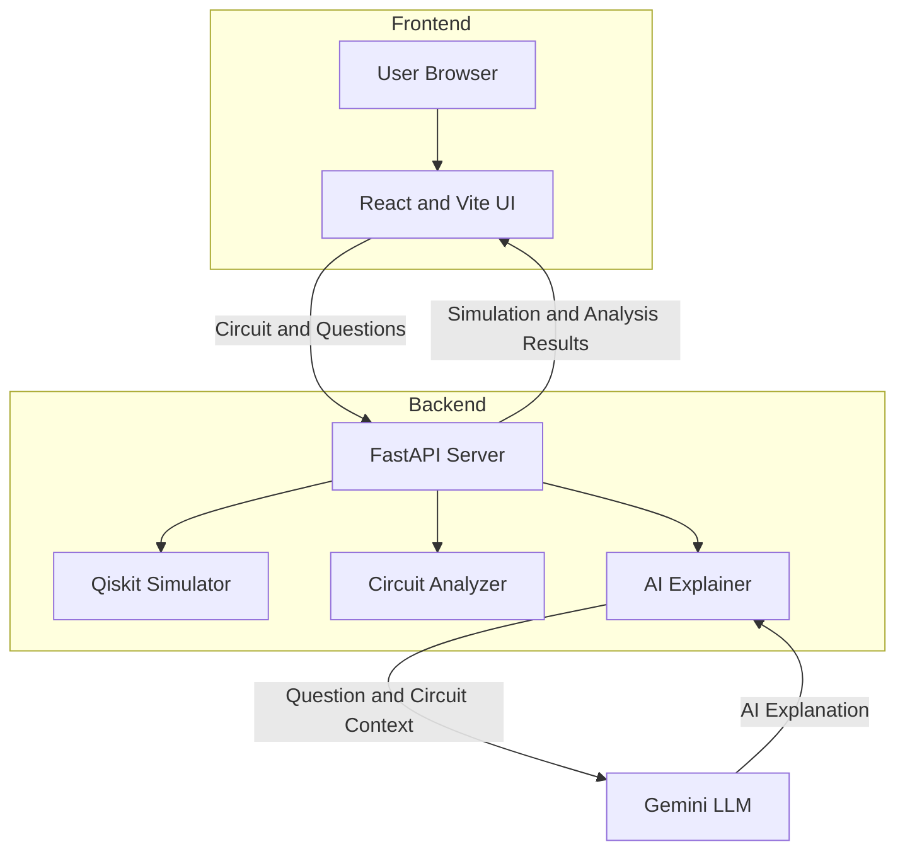
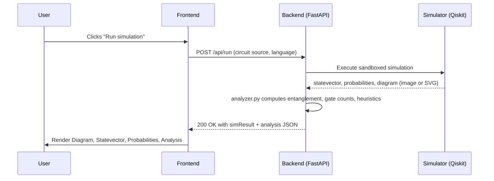
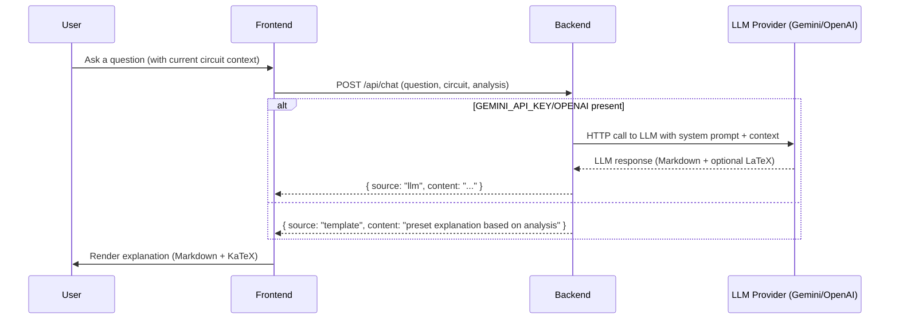

# Quantum Circuit Explorer & AI Tutor — Project Information

This document describes the project end-to-end: architecture, components, data and network flows, developer workflow, key files, tech stack, environment variables, LLM integration, UI behaviour, and deployment notes. Use this as a single-source reference for maintainers and reviewers.

---

## 1 — High-level overview

Quantum Circuit Explorer & AI Tutor is an MVP web application that lets users input or paste small quantum circuits (Qiskit/OpenQASM), run a local simulation, inspect the circuit diagram/statevector/probabilities, and ask an AI-powered tutor for explanations and suggestions.

Key goals:
- Fast local iteration for circuit design and inspection.
- Deterministic simulation + basic pattern detection (Bell, GHZ, QFT heuristics).
- Template-based AI explanations by default; optional real LLM integration via `OPENAI_API_KEY` or `GEMINI_API_KEY` provided in backend `.env`.
- Safe local code execution sandbox for short circuit simulations.


## 2 — Architecture

Overall architecture (frontend ↔ backend):



Notes:
- The frontend runs in the user's browser and calls backend endpoints via the Vite dev proxy (development) or directly to the server in production.
- The backend owns all secrets and environment variables (no API keys in frontend).


## 3 — Main flows

### 3.1 Run simulation (user clicks `Run simulation`)



- The backend runs the circuit using a restricted execution environment (subprocess sandbox) and returns structured JSON containing simulation outputs and analysis metadata used by the frontend to render the panels.

### 3.2 Ask the tutor (chat)



- The backend only calls the external LLM when the key is present and the user asks a question; otherwise it returns the built-in template explainer.


## 4 — Component breakdown

### Backend (directory: `backend/`)
- `app/main.py` — FastAPI app and route wiring. Key endpoints used by the frontend include explain/chat endpoints.
- `app/simulator.py` — wraps Qiskit circuit execution and returns statevector and probabilities in JSON-friendly formats.
- `app/analyzer.py` — heuristics to detect entanglement, pattern matches (Bell/GHZ/QFT/Grover), gate counts, depth, and simple optimization hints.
- `app/execution.py` — sandboxed runner to execute user-provided circuit code in a subprocess with timeouts and resource limits.
- `app/explainer.py` — combines the template explainer with LLM call logic (OpenAI + Gemini fallback). Reads `.env` for `OPENAI_API_KEY` and `GEMINI_API_KEY`.
- `app/models.py` — data models (pydantic schemas) for request/response payloads.
- `requirements.txt` — Python dependencies (FastAPI, httpx, python-dotenv, qiskit, etc.).

How LLM integration is structured:
- `explainer.py` first loads `.env` via `python-dotenv` to keep keys backend-only.
- When `GEMINI_API_KEY` is set, the code uses the `gemini-3.6-flash` endpoint and passes the key in the `x-goog-api-key` header.
- If Gemini/OpenAI is unavailable or errors, the backend falls back to the template explainer.

Security and sandboxing:
- `execution.py` runs user circuits in a subprocess (the repo warns that this is not a production-grade boundary).
- Recommended: containerize or use an isolated VM for multi-tenant or public deployment.


### Frontend (directory: `frontend/`)
- `src/main.jsx` — app bootstrap (Vite + React entry).
- `src/App.jsx` — top-level layout, state orchestration for circuits, simulation triggers, and resizable panels (this repo implements draggable dividers for chat and code editor heights).
- `src/components/CodeEditor.jsx` — Monaco-based editor to write circuits in Qiskit/OpenQASM.
- `src/components/ChatPanel.jsx` — chat UI; renders tutor responses as Markdown with KaTeX using `react-markdown`, `remark-math`, `rehype-katex` and `katex`.
- `src/components/ResultsTabs.jsx` — tabs for Diagram, Statevector, Probabilities. Diagram image is displayed responsively.
- `src/components/Sidebar.jsx` — examples and circuit list; legend removed per project decisions.
- `package.json` — frontend deps: React, Vite, Tailwind, Monaco, plus Markdown/KaTeX deps (`react-markdown`, `remark-gfm`, `remark-math`, `rehype-katex`, `katex`).

UI behaviors:
- Panels are resizable by dragging divider bars — chat height and code editor height are adjustable.
- Chat messages are rendered as Markdown; KaTeX handles inline and display math.
- The diagram image scales (object-contain) to fit available panel space.


## 5 — Data shapes

Typical `simResult` (simplified):

```json
{
  "statevector": ["0.707+0j","0+0j","0+0j","0.707+0j"],
  "probabilities": {"00": 0.5, "11": 0.5},
  "diagram": "data:image/png;base64,...",
  "analysis": { "entanglement": {"per_qubit_entropy": [...]}, "patterns": ["Bell"] }
}
```

Chat payload to backend (simplified):

```json
{ "question": "Is this circuit entangled?", "circuit_source": "...", "analysis": { ... } }
```

LLM returns Markdown text (prefer compact Markdown with KaTeX for math). Backend passes raw Markdown to frontend for rendering.


## 6 — Developer workflow

Local dev (two terminals):

```bash
# Terminal 1 -- backend
cd backend
python3 -m venv .venv && source .venv/bin/activate
pip install -r requirements.txt
uvicorn app.main:app --reload --port 8000

# Terminal 2 -- frontend
cd frontend
npm install
npm run dev
```

Open `http://localhost:5173` (Vite dev server) and use the UI. To test LLM integration, create a `backend/.env` with `GEMINI_API_KEY` or `OPENAI_API_KEY` (see `backend/.env.example`).

Build for production:

```bash
# frontend
cd frontend
npm install
npm run build

# backend - run via uvicorn or containerize
uvicorn app.main:app --host 0.0.0.0 --port 8000
```


## 7 — Important files & where to look for features

- `README.md` — project quickstart and feature matrix.
- `projectInfo.md` — (this file) full project reference and diagrams.
- `backend/app/explainer.py` — LLM integration & template fallback logic.
- `backend/app/simulator.py` — Qiskit integration and simulator wrapper.
- `frontend/src/components/ChatPanel.jsx` — Markdown + KaTeX rendering of tutor content.
- `frontend/src/App.jsx` — draggable dividers, editor resizing, and main layout orchestration.


## 8 — Testing & verification

- Unit tests: not included in the MVP. When adding tests, focus on:
  - Simulator determinism (given a circuit source, expect the same statevector).
  - Analyzer heuristics (pattern detection unit tests with canonical circuits).
  - Explainer fallback (no API key returns template output).
- Manual E2E: run backend and frontend locally and exercise example circuits from the sidebar.


## 9 — Deployment notes

- Keep API keys out of the frontend; only store them in server-side `.env` or secrets store.
- For production, host the backend behind HTTPS and an authentication layer if making public.
- Replace subprocess sandbox with containerized or VM-backed isolation for safety.
- Consider rate-limiting and caching LLM responses to avoid repeated calls and cost spikes.


## 10 — Extending the project

- Add Cirq input support by creating `circuit_from_cirq_source()` alongside Qiskit parser.
- Replace heuristic pattern matching with a DAG-embedding similarity search or learned model.
- Persist circuits and histories in a database (Postgres) and add shareable links.
- Add CI that runs the static checks and a small set of canonical circuit tests.


---


<!-- EOF -->
